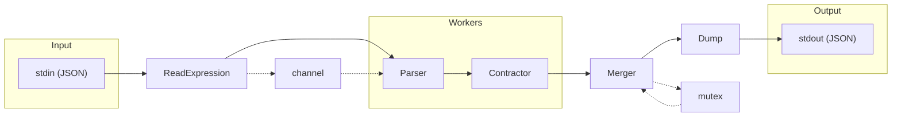
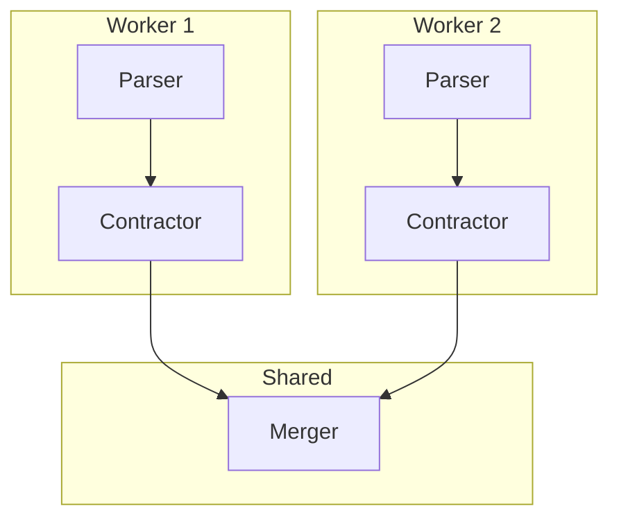
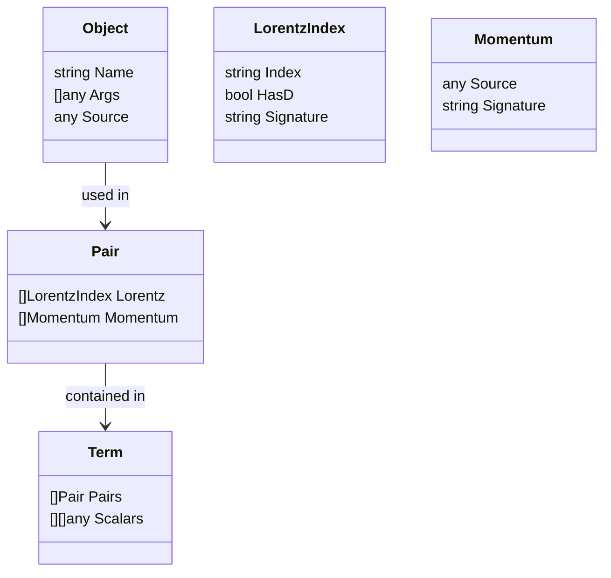

# FeynGrav Index Contractor

> AI-generated and human-reviewed.

High-performance Go-based tensor index contraction system (~100× faster than Mathematica), designed for gravitational Feynman diagram calculations in theoretical physics.

---

## What is Index Contraction?

Index contraction is a fundamental tensor operation in quantum field theory and general relativity. When a tensor has repeated indices (one upper, one lower), contraction sums over all values of that index.

For example, `g^{μν} g_{μν}` in 4D spacetime contracts to the scalar value 4.

In FeynGrav calculations, indices represent:
- **Lorentz indices** (μ, ν, ρ, ...): spacetime coordinates
- **Momentum** (p, q, k, ...): four-momentum vectors

Contraction rules:
- Two identical Lorentz indices → scalar factor (4 or D)
- Two identical momenta → pass through (no contraction)
- Lorentz + momentum → mixed structure (remains uncontracted)

---

## Architecture





The system utilizes a fixed-size worker pool (default: `runtime.NumCPU()`). Each worker operates independently with its own `Parser` and `Contractor` (minimizing contention), while sharing a single mutex-protected `Merger`.

---

## Processing Pipeline

The pipeline consists of 5 stages executed by parallel workers:

### 1. Input (`external.ReadExpression`)

Streams JSON terms from stdin:
- Validates the JSON starts with `[Plus, ...]`
- Uses `json.Decoder` with `UseNumber()` for precise number handling
- Streams each term individually through a channel

This approach processes arbitrarily large expressions without loading everything into memory.

### 2. Parse (`parse.Parser`)

Converts raw JSON terms into internal `node.Term` structures:
- **Object parsing**: Converts JSON array to `Object` with name and arguments
- **Times handling**: Recursively processes multiplication arguments
- **Power expansion**: Expands `Power[expr, n]` into n copies of expr
- **Pair extraction**: Identifies `Pair[LorentzIndex, ...]` and `Pair[Momentum, ...]`

### 3. Contract (`contract.Contractor`)

Performs index contraction via `ContractAndNormalize()`:
1. Collects all Lorentz indices from pairs
2. Finds pairs with matching JSON signatures
3. Contracts: identical Lorentz indices → scalar (4 or D), identical momenta → pass through
4. Sorts remaining pairs by signature for deterministic output

### 4. Merge (`merge.Merger`)

Groups contracted terms by remaining index structure:
- Computes signature by JSON-marshaling pairs
- Terms with identical structure are grouped together
- Accumulates scalar coefficients

### 5. Output (`external.Dump`)

Serializes results as JSON:
- Single term → output directly
- Empty result → output `0`
- Multiple terms → wrap in `Plus[...]`

---

## Dimensional Regularization

The codebase implements dimensional regularization, a QFT technique for handling divergences:

- `LorentzIndex["mu"]` — ordinary spacetime index, contracts to **4**
- `LorentzIndex["mu", "D"]` — derivative index (∂_μ), contracts to **D**

When two derivative indices contract, the result is the spacetime dimension D (not 4). This distinction is crucial for proper loop integral handling.

---

## Index Contraction Algorithm

The core algorithm in `Contractor.addPair()`:

1. For each incoming pair, collect all Lorentz indices
2. Check if any indices already have a matching partner in `indexPairs` map
3. If match found: remove matched pair, accumulate scalar (4 or D), merge remaining indices
4. If no match: store pair for future matching
5. After processing all pairs, handle remaining unpaired indices

Matching utilizes **JSON signatures**: `json.Marshal(Source)` provides a unique key, handling arbitrarily complex index structures and dimensional regularization flags correctly.

---

## Data Structures



- **Object**: Represents any Mathematica function call (`Name` + `Args` + `Source`)
- **LorentzIndex**: Spacetime index with optional D-flag for derivatives
- **Momentum**: Four-momentum vector
- **Pair**: Container for Lorentz indices and/or momenta
- **Term**: Complete expression (product of pairs times scalars)

---

## Package Structure

| Package | Purpose |
|---------|---------|
| `cmd/contractor` | Entry point, thread pool management |
| `pkg/external` | JSON I/O (`ReadExpression`, `Dump`) |
| `pkg/pipeline/parse` | Expression parsing, Power expansion |
| `pkg/pipeline/contract` | Core index contraction logic |
| `pkg/pipeline/merge` | Term grouping by signature |
| `pkg/pipeline/node` | Data structures (`Object`, `Term`, `Pair`, etc.) |
| `pkg/literal` | Mathematica function name constants |

---

## Input/Output Format

The system uses Mathematica's ExpressionJSON format:

**Input:**
```json
["Plus", ["Times", 2, ["Pair", ["LorentzIndex", "mu"], ["LorentzIndex", "nu"]]]]
```

**Output:**
```json
["Plus", ["Times", 4, ["Pair", ["LorentzIndex", "mu"], ["LorentzIndex", "nu"]]]]
```

Structure:
- Root: `[Plus, term1, term2, ...]`
- Term: `[Times, scalar1, ...pair1, pair2]`
- Pair: `[Pair, index1, index2]`
- Index: `[LorentzIndex, "mu"]` | `[LorentzIndex, "mu", "D"]` | `[Momentum, "p"]`

---

## Usage

```bash
# Build
make build

# Run with default threads (all CPU cores)
./contractor < input.json > output.json

# Specify thread count
./contractor -threads 4 < input.json > output.json
```

**Integration with Mathematica:**
```mathematica
SetDirectory[NotebookDirectory[]];
stream = OpenWrite["!./contractor -threads 4"];
WriteString[stream, ExportString[expr, "ExpressionJSON"]];
Close[stream];
result = ImportString[%, "ExpressionJSON"];
```

---

## Performance Optimizations

| Optimization | Description |
|--------------|-------------|
| Parallel workers | Multiple CPU cores process terms concurrently |
| Lock-free parsing | Each worker has its own parser (no contention) |
| Unsafe string ops | Zero-copy JSON → string for map keys |
| Streaming I/O | Large expressions processed without full memory load |
| Buffer reuse | Pre-allocated slices cleared and reused |

Scaling: The thread count should match the number of available CPU cores. Performance scales linearly with the number of terms.

---

## Limitations

- No algebraic simplification beyond index contraction
- No symbolic manipulation of scalar expressions
- Input must be properly formatted ExpressionJSON