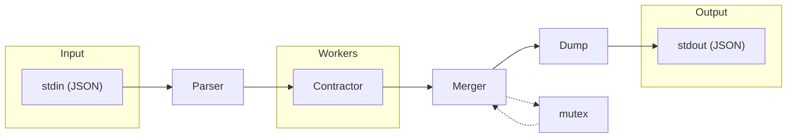
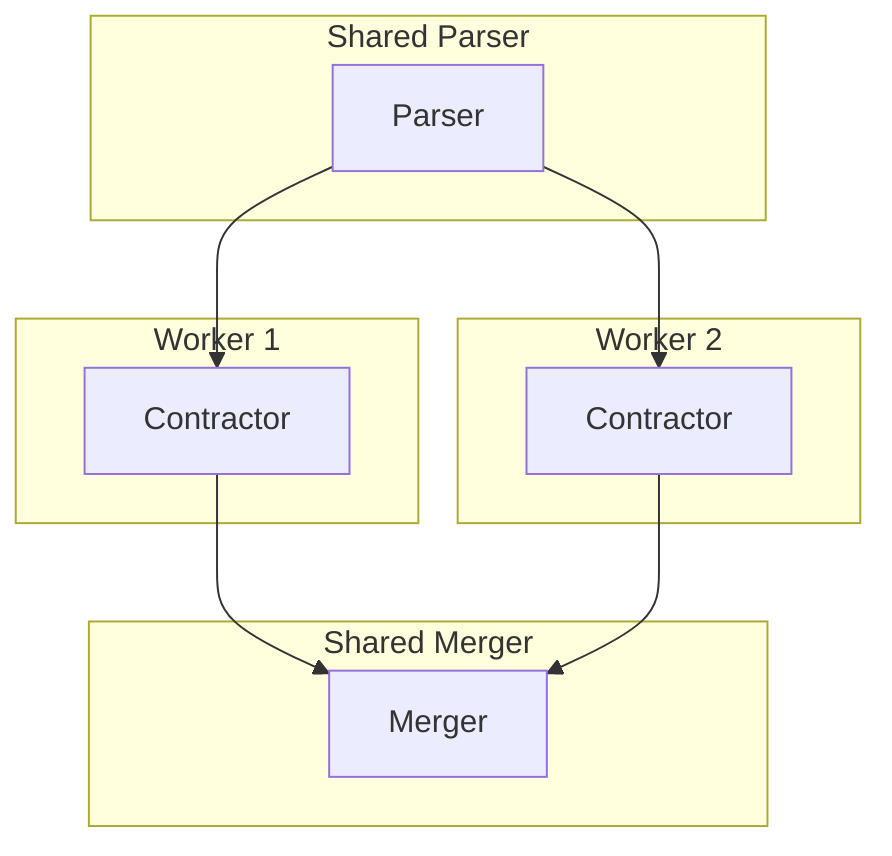
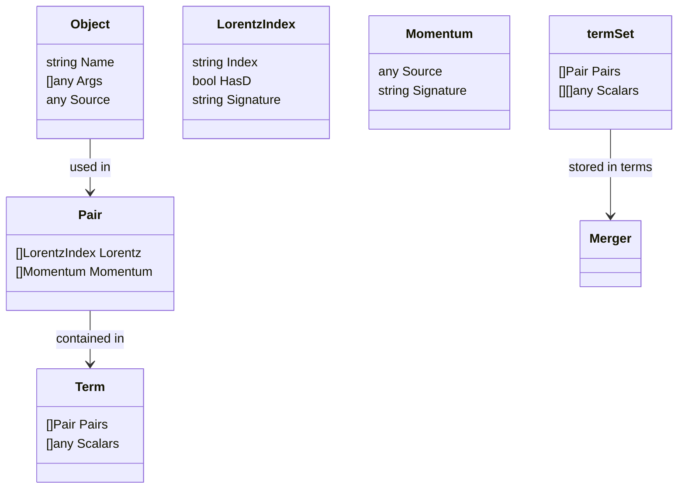

# FeynGrav Index Contractor

> AI-generated and human-reviewed.

High-performance Go-based tensor index contraction system (~100× faster than Mathematica), designed for gravitational Feynman diagram calculations in theoretical physics.

---

## What is Index Contraction?

In conventional tensor notation, contraction corresponds to summing over a repeated index, usually one upper and one lower. In FeynCalc's internal representation, the corresponding contraction is encoded through repeated compatible Lorentz indices appearing in `Pair` objects.

For example, `g^{μν} g_{μν}` in 4D spacetime contracts to the scalar value 4.

In FeynGrav calculations, indices represent:
- **Lorentz indices** (`mu`, `nu`, `rho`, ...): indices labelling components of Lorentz tensors and vectors
- **Momentum labels** (`p`, `q`, `k`, ...): labels for momentum objects, optionally carrying a dimension label

Contraction rules:
- A repeated Lorentz index is contracted according to the usual Einstein convention.
- A metric trace in 4 dimensions gives `4`; a metric trace in `D` dimensions gives `D`.
- A product of two vectors with the same Lorentz index contracts to the corresponding scalar product.
- A `Pair[Momentum[p], Momentum[q]]` already represents a scalar product; it is not an index contraction.
- A single `Pair[LorentzIndex[mu], Momentum[p]]` represents a vector with a free Lorentz index and is contracted only when another compatible Lorentz index is present.

---

## Architecture





The system utilizes a fixed-size worker pool (default: `runtime.NumCPU()`). A single shared `Parser` streams parsed terms to all workers. Each worker operates independently with its own `Contractor` (minimizing contention), while sharing a single mutex-protected `Merger`.

---

## Processing Pipeline

The pipeline consists of 4 stages executed by parallel workers:

### 1. Parse (`parse.Parser.ParseJson`)

Streams and parses JSON expressions from stdin into internal `node.Term` structures:
- Uses `jsontext.Decoder` for incremental JSON parsing (requires `GOEXPERIMENT=jsonv2`)
- Handles `Plus` (addition), `Times` (multiplication), `Power` (exponentiation), and `Pair` objects
- **Times handling**: Multiplies subexpressions using lazy evaluation with `termSource`
- **Power expansion**: Expands `Power[expr, n]` into n multiplications of expr
- **Pair extraction**: Identifies `Pair[LorentzIndex, ...]` and `Pair[Momentum, ...]`
- Streams terms through channels for memory-efficient processing of large expressions

### 2. Contract (`contract.Contractor`)

Performs dimension-aware Lorentz contractions via `ContractAndNormalize()`:

1. Identifies `Pair` objects representing metric tensors, Lorentz vectors, and scalar products.
2. Collects Lorentz indices from those pairs, including their dimension labels.
3. Finds compatible repeated Lorentz indices using JSON signatures.
4. Performs the corresponding Lorentz contraction:
   * metric traces produce the dimension of the corresponding Lorentz space, for example `4` or `D`;
   * metric-vector contractions remove the contracted index and relabel the vector with the remaining free Lorentz index;
   * vector-vector contractions produce scalar products;
   * momentum-momentum `Pair` objects are already scalar products and are not themselves index contractions.
5. Sorts remaining pairs by signature for deterministic output.

### 3. Merge (`merge.Merger`)

Groups contracted terms by remaining index structure:
- Uses `termSet` structure containing pairs and scalar lists
- Computes signature by JSON-marshaling pairs
- Terms with identical structure are grouped together
- Accumulates scalar coefficient lists from each term

### 4. Output (`external.Dump`)

Serializes results as JSON:
- Single term → output directly
- Empty result → output `0`
- Multiple terms → wrap in `Plus[...]`

---

## Dimension-Aware Lorentz Contractions

This project is designed to process expressions that follow the internal tensor representation used by FeynCalc. FeynCalc is a Wolfram Mathematica package for symbolic evaluation of Feynman diagrams and algebraic calculations in quantum field theory and elementary particle physics. Its source code is available in the FeynCalc GitHub repository, and its online reference guide gives the authoritative definitions of the objects discussed below:

* FeynCalc GitHub repository: `https://github.com/FeynCalc/feyncalc`
* FeynCalc online reference guide: `https://feyncalc.github.io/reference`

The discussion below only summarizes the parts of FeynCalc that are relevant for the contractor. For a complete description of FeynCalc syntax, internal representations, and available algebraic operations, the user should consult the official reference guide.

FeynCalc distinguishes Lorentz objects living in four dimensions from Lorentz objects living in an arbitrary symbolic number of dimensions. The arbitrary dimension is usually denoted by `D`. This distinction is essential in calculations that use dimensional regularization, where loop integrals and tensor expressions are often evaluated in $D = 4 - 2 \, \epsilon$ rather than strictly in four dimensions.

In FeynCalc, the second argument of `LorentzIndex` or `Momentum` is a dimension label. It is not a marker for derivative indices. 

For example,
```mathematica
LorentzIndex[mu]
```
denotes a four-dimensional Lorentz index, while
```mathematica
LorentzIndex[mu, D]
```
denotes a Lorentz index in `D` dimensions.

Similarly,
```mathematica
Momentum[p]
```
denotes a four-dimensional momentum, while
```mathematica
Momentum[p, D]
```
denotes a momentum in `D` dimensions.

FeynCalc represents metric tensors, Lorentz vectors, and scalar products internally using `Pair`. The meaning of `Pair[x, y]` depends on whether its arguments are Lorentz indices or momenta.

A four-dimensional metric tensor is represented as
```mathematica
Pair[LorentzIndex[mu], LorentzIndex[nu]]
```
whereas a `D`-dimensional metric tensor is represented as
```mathematica
Pair[LorentzIndex[mu, D], LorentzIndex[nu, D]]
```
A four-dimensional Lorentz vector $p^\mu$ is represented as
```mathematica
Pair[LorentzIndex[mu], Momentum[p]]
```
whereas a `D`-dimensional Lorentz vector $p^\mu$ is represented as
```mathematica
Pair[LorentzIndex[mu, D], Momentum[p, D]]
```

Scalar products are represented by pairing two momenta. For example,
```mathematica
Pair[Momentum[p], Momentum[q]]
```
represents the four-dimensional scalar product of `p` and `q`, while
```mathematica
Pair[Momentum[p, D], Momentum[q, D]]
```
represents the corresponding `D`-dimensional scalar product.

The contractor must therefore preserve the dimension labels attached to Lorentz indices and momenta. In particular,
```mathematica
Pair[LorentzIndex[mu], LorentzIndex[mu]]
```
contracts to `4` while
```mathematica
Pair[LorentzIndex[mu, D], LorentzIndex[mu, D]]
```
contracts to `D`.

Likewise, repeated Lorentz indices in vector expressions are contracted according to their dimension. For example,
```mathematica
Pair[LorentzIndex[mu], Momentum[p]] Pair[LorentzIndex[mu], Momentum[q]]
```
contracts to the four-dimensional scalar product
```mathematica
Pair[Momentum[p], Momentum[q]]
```
whereas
```mathematica
Pair[LorentzIndex[mu, D], Momentum[p, D]] Pair[LorentzIndex[mu, D], Momentum[q, D]]
```
contracts to the `D`-dimensional scalar product
```mathematica
Pair[Momentum[p, D], Momentum[q, D]]
```

A free Lorentz index should not be contracted. For instance,
```mathematica
Pair[LorentzIndex[mu], LorentzIndex[nu]]
```
represents a metric tensor with two free Lorentz indices. It does not contract to `4` unless the two indices are identified, or unless it is multiplied by another tensor expression that supplies the corresponding repeated indices.

This should not be interpreted as a full implementation of dimensional regularization. The contractor does not evaluate loop integrals, expand expressions around $D = 4 - 2 \, \epsilon$, or manipulate ultraviolet or infrared poles. Its role is narrower: it performs dimension-aware Lorentz contractions in a way compatible with FeynCalc's internal representation.


---

## Index Contraction Algorithm

The core algorithm in `Contractor.addPair()`:

1. For each incoming `Pair`, identify whether it represents a metric tensor, a Lorentz vector, or a scalar product.
2. Collect the Lorentz indices carried by the incoming `Pair`, including their dimension labels.
3. Check whether any of these Lorentz indices already has a compatible matching partner stored in the `indexPairs` map.
4. If a compatible match is found, remove the matched object from `indexPairs` and perform the corresponding Lorentz contraction:
   - a metric trace produces the dimension of the corresponding Lorentz space, for example `4` or `D`;
   - a metric-vector contraction removes the contracted index and leaves the vector with the remaining free Lorentz index;
   - a vector-vector contraction produces the corresponding scalar product;
   - a scalar product `Pair[Momentum[p], Momentum[q]]` is already a scalar object and is not itself an index contraction.
5. If no compatible match is found, store the incoming `Pair` for possible contraction with later factors.
6. After all pairs in the term have been processed, keep the remaining unmatched pairs as the free-index tensor structure of the term.
7. Sort the remaining pairs by signature to obtain deterministic output.

Matching utilizes **JSON signatures**: `json.Marshal(Source)` provides a unique key for comparing Lorentz indices, momenta, and their dimension labels. This allows the contractor to distinguish four-dimensional and `D`-dimensional Lorentz objects consistently.

---

## Data Structures



- **Object**: Represents any Mathematica function call (`Name` + `Args` + `Source`)
- **LorentzIndex**: Represents a Lorentz index. The `HasD` field records whether the index carries the `D`-dimensional label, as in `LorentzIndex[mu, D]`.
- **Momentum**: Represents a momentum object, such as `Momentum[p]` or `Momentum[p, D]`. Its dimensional information is preserved through the original `Source` and the corresponding `Signature`.
- **Pair**: Represents a FeynCalc `Pair` object. Depending on its contents, it may represent a metric tensor, a Lorentz vector, or a scalar product.
- **Term**: Represents a product of tensorial `Pair` objects and scalar factors.
- **termSet**: Merger's internal structure for grouping terms with identical remaining tensor structure and collecting their scalar coefficient lists.

---

## Package Structure

| Package | Purpose |
|---------|---------|
| `cmd/contractor` | Entry point, thread pool management |
| `pkg/external` | JSON output (`Dump`) |
| `pkg/pipeline/parse` | Streaming JSON parsing with `jsontext`, handles `Plus`/`Times`/`Power`/`Pair` |
| `pkg/pipeline/contract` | Core index contraction logic |
| `pkg/pipeline/merge` | Term grouping by signature using `termSet` |
| `pkg/pipeline/node` | Data structures (`Object`, `Term`, `Pair`, etc.) |
| `pkg/literal` | Mathematica function name constants |

---

## Input/Output Format

The system uses Mathematica's `ExpressionJSON` format to exchange expressions with external programs. In this format, a Mathematica expression is represented as a JSON array whose first element is the head of the expression and whose remaining elements are its arguments.

For example, the FeynCalc expression
```mathematica
Pair[LorentzIndex[mu], LorentzIndex[mu]]
```
is represented schematically as
```json
["Pair", ["LorentzIndex", "mu"], ["LorentzIndex", "mu"]]
```
This expression is a four-dimensional metric trace and therefore contracts to `4`.

A vector-vector contraction provides a less trivial example. The expression
```mathematica
Pair[LorentzIndex[mu], Momentum[p]] Pair[LorentzIndex[mu], Momentum[q]]
```
is represented schematically as
```json
[
  "Times",
  ["Pair", ["LorentzIndex", "mu"], ["Momentum", "p"]],
  ["Pair", ["LorentzIndex", "mu"], ["Momentum", "q"]]
]
```
After contraction, the repeated Lorentz index is removed and the result is the scalar product
```json
["Pair", ["Momentum", "p"], ["Momentum", "q"]]
```

By contrast, the expression
```mathematica
Pair[LorentzIndex[mu], LorentzIndex[nu]]
```
is represented as
```json
["Pair", ["LorentzIndex", "mu"], ["LorentzIndex", "nu"]]
```
and should not contract to `4`, because it is a metric tensor with two free Lorentz indices.

Structure:

- Root: `["Plus", term1, term2, ...]` for sums, or a single term/object when the expression contains only one term.
- Term: `["Times", scalar1, ..., pair1, pair2, ...]` for products.
- Pair: `["Pair", object1, object2]`.
- Lorentz index: `["LorentzIndex", "mu"]` for a four-dimensional index, or `["LorentzIndex", "mu", "D"]` for a `D`-dimensional index.
- Momentum: `["Momentum", "p"]` for a four-dimensional momentum, or `["Momentum", "p", "D"]` for a `D`-dimensional momentum.


---

## Usage

```bash
# Build
make build

# Run with default threads (all CPU cores)
./contractor < input.json > output.json

# Specify thread count
./contractor -threads 4 < input.json > output.json
```

**Integration with Mathematica:**
```mathematica
SetDirectory[NotebookDirectory[]];
stream = OpenWrite["!./contractor -threads 4"];
WriteString[stream, ExportString[expr, "ExpressionJSON"]];
Close[stream];
result = ImportString[%, "ExpressionJSON"];
```

---

## Performance Optimizations

| Optimization | Description |
|--------------|-------------|
| Parallel workers | Multiple CPU cores process terms concurrently |
| Lock-free parsing | Each worker has its own parser (no contention) |
| Unsafe string ops | Zero-copy JSON → string for map keys |
| Streaming I/O | Large expressions processed without full memory load |
| Buffer reuse | Pre-allocated slices cleared and reused |

Scaling: The thread count should match the number of available CPU cores. Performance scales linearly with the number of terms.

---

## Limitations

- No algebraic simplification beyond index contraction
- No symbolic manipulation of scalar expressions
- Input must be properly formatted ExpressionJSON
